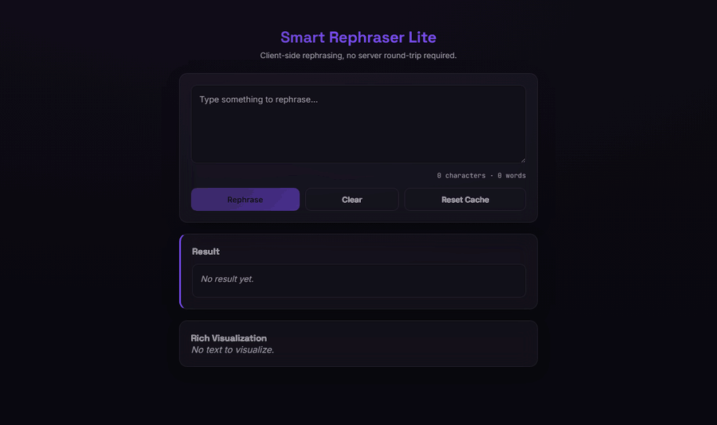
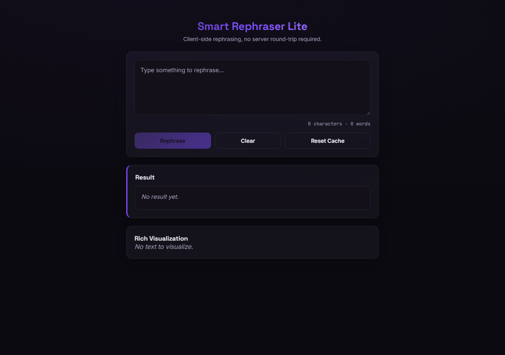

<div align="center">

<br>

# ✎ &nbsp;S M A R T &nbsp; R E P H R A S E R &nbsp; L I T E

### **Rephrase text without sending it anywhere.**

A small React app that rewrites your sentences entirely in the browser —<br>
no backend, no API key, no network call in the rephrasing path at all.

<br>

[](https://github.com/abheet19/Smart-Rephraser-Lite/actions/workflows/ci.yml)
[](https://github.com/abheet19/Smart-Rephraser-Lite/actions/workflows/deploy-pages.yml)
[](#-tech-stack)
[](#-tech-stack)
[](package.json)

<br>



<sub>The real app, recorded live: type a sentence, hit **Rephrase**, and the rewrite plus the token
panel appear instantly — no server, no API key, no network call.</sub>

<br>

<sub>A personal project by <b><a href="https://github.com/abheet19">Abheet</a></b> — a tiny, fully client-side writing tool.</sub>

<br>

**[Try it live →](https://abheet19.github.io/Smart-Rephraser-Lite/)**

</div>

---

## Why this exists

Most "AI rephrasing" tools ship your text to a server before you get a word back. Smart Rephraser Lite is the
opposite bet: a lightweight paraphraser — filler-word trimming, contraction expansion, synonym substitution, and
clause reordering — built as a small, dependency-free pipeline that runs synchronously in the tab. No key to
configure, no quota, no round-trip. The trade-off is honest: it won't out-write a hosted LLM, but everything it
does output is fast, private, and yours.

---

## 🧭 At a glance

| Piece                | What it does                                                                                                              |
| -------------------- | ------------------------------------------------------------------------------------------------------------------------- |
| **`paraphrase.js`**  | The pipeline: trim fillers → expand/contract → substitute synonyms → fix articles → reorder clauses                       |
| **`synonyms.js`**    | A hand-picked table of a few hundred common words, one plain-English replacement each                                     |
| **`CacheContext`**   | Caches every rephrase by input text, backed by `chrome.storage.local` in the extension build or `localStorage` on the web |
| **Service worker**   | Offline-first caching of the built assets, with an in-app "update available" toast                                        |
| **Chrome extension** | The same React app, built a second time as a popup (`extension/`)                                                         |

---

## 🚀 Install &amp; run

```powershell
git clone https://github.com/abheet19/Smart-Rephraser-Lite.git
cd Smart-Rephraser-Lite
npm install
npm run dev
```

<table>
<tr>
<td width="50%" valign="top">

**Build for the web**

```powershell
npm run build
npm run preview
```

Outputs to `dist/` — this is what deploys to GitHub Pages on every push to `main`.

</td>
<td width="50%" valign="top">

**Test &amp; lint**

```powershell
npm run test:unit
npm run lint
```

Unit tests cover the paraphrase pipeline directly; `npm run test:e2e` drives the built app with Playwright.

</td>
</tr>
</table>

---

## 🛠 Tech stack


No runtime dependencies beyond React itself — the rephrasing logic is plain JavaScript, no ML runtime, no
third-party API client.

---

## 🎨 Design

Dark ground with a violet/orchid accent (`#0B0A10` → `#B98BFF` / `#7C4DFF` / `#5A3FA0`), glass-morphism cards,
Space Grotesk for display type and Inter for body text — one project in a small family of side-projects that
each get their own accent color rather than sharing one theme. The Rephrase button carries a soft violet glow
and the result panel has an accent-colored left border; both are this app's own detail, not copied from its
siblings.

---

## 📸 Screenshots

Captured live from [the deployed app](https://abheet19.github.io/Smart-Rephraser-Lite/).



### Regenerating the demo GIF

The hero GIF at the top is a real Playwright recording of the deployed app, not a mockup. Re-record it
whenever the UI changes:

```powershell
node tools/record-demo.mjs        # drives the app, writes PNG frames
python tools/build-demo-gif.py    # assembles docs/demo/hero.gif (Pillow)
```

Set `DEMO_URL` to record a local build instead (`npm run build && npm run preview`).

---

<div align="center">

<br>

Built by **[Abheet Singh Isher](https://github.com/abheet19)**

<br>

</div>
